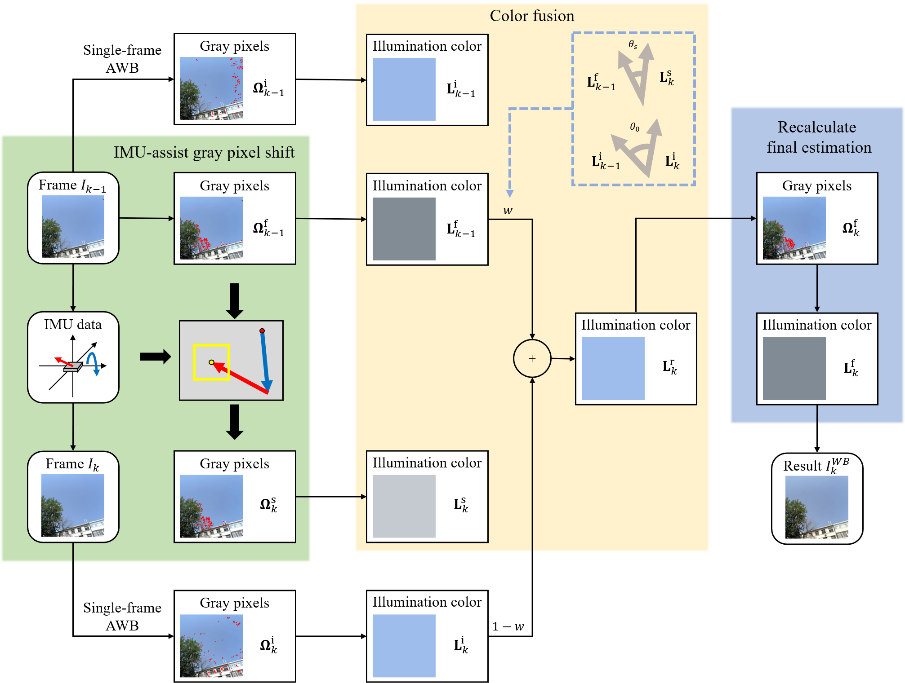

# IMUGPS

Android implementation of paper `IMU-Assisted Gray Pixel Shift for Video White Balance Stabilization`

## Environment and Setup

To run the code, you should:

1. Import [Opencv 4.8.0 for android](https://github.com/opencv/opencv/releases/download/4.8.0/opencv-4.8.0-android-sdk.zip) as module
2. Modify the camera intrinsic matrix in [native-lib.cpp](Code/app/src/main/cpp/native-lib.cpp#L54) to your camera's